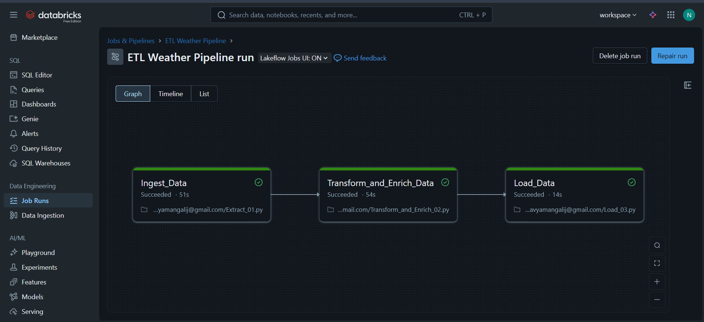
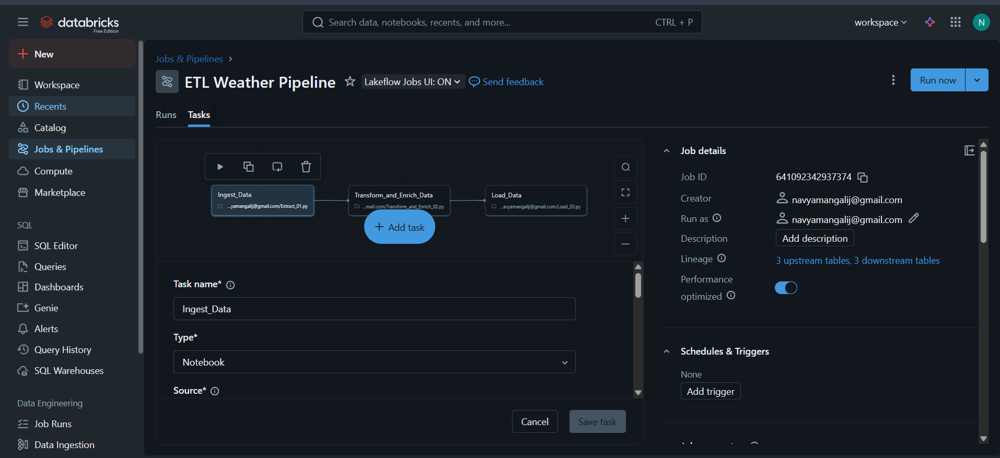
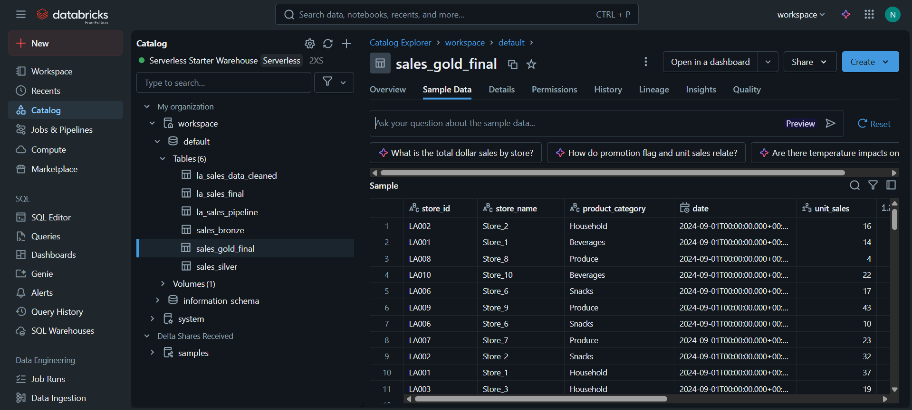

# End-to-End Retail ETL Pipeline on Databricks


---

## 1. Project Overview

This project showcases a complete, end-to-end ETL pipeline built on the Databricks Lakehouse Platform. The primary goal is to ingest raw daily retail sales data, apply a series of data cleaning and transformation steps, enrich the dataset with historical weather information from the OpenWeatherMap API, and load the final, analysis-ready data into a structured Gold-layer Delta table.

The pipeline follows the industry-standard **Medallion Architecture** (Bronze, Silver, Gold) to ensure data quality and traceability. The entire workflow is automated using **Databricks Workflows**, demonstrating a robust and production-ready approach to data engineering.

---

## 2. Pipeline Architecture

The pipeline is designed as a multi-task Databricks Job, where each task executes a separate notebook responsible for a specific stage of the ETL process. Data is passed between tasks by writing and reading from Delta tables.

### Job Workflow:


### Data Flow (Medallion Architecture):

-   **Bronze Layer (`sales_bronze` table):** The `01_Extract` notebook reads raw data from the source and saves it in its original, unaltered state.
-   **Silver Layer (`sales_silver` table):** The `02_Transform_and_Enrich` notebook cleans, validates, and enriches the Bronze data. In this pipeline, weather information is added at this stage.
-   **Gold Layer (`sales_gold_final` table):** The `03_Load` notebook creates the final, presentation-ready table, which is optimized for analytics and business intelligence.

---

## 3. Repository Structure
```
├── 📂 notebooks/
│   ├── 01_Extract.ipynb
│   ├── 02_Transform_and_Enrich.ipynb
│   └── 03_Load.ipynb
├── 📂 images/
│   ├── databricks_workflow_graph.png
│   ├── final_gold_table_preview.png
│   └── workflow_run_details.png
├── .gitignore
├── LICENSE
├── README.md
└── requirements.txt
```

---

## 4. Technologies Used
- **Cloud Platform:** Databricks
- **Orchestration:** Databricks Workflows (Jobs)
- **Language:** Python
- **Core Libraries:** Pandas, PySpark, Requests, NumPy
- **Data Storage:** Delta Lake, Spark SQL, Unity Catalog (Volumes)

---

## 5. Setup and Configuration Guide

Follow these steps to set up the pipeline in your environment.

### Step 1: Upload Notebooks and Data
1.  **Upload Notebooks:** Upload the three notebooks from the `notebooks` folder of this repository into a directory in your Databricks Workspace.
2.  **Upload Data:** Upload the daily sales CSV files to a location in your Databricks Volume (e.g., `/Volumes/main/default/my_files/LA_Retail_Sales_By_Day/`).

### Step 2: Configure Databricks Secrets (for API Key)
To securely store your API key, you must create a Databricks secret. This requires the [Databricks CLI](https://docs.databricks.com/en/dev-tools/cli/index.html).

1.  **Create a Secret Scope:** In your local terminal, run:
    ```
    databricks secrets create-scope --scope retail_etl_project
    ```
2.  **Add Your API Key:** Run the following command. A text editor will open for you to paste your key.
    ```
    databricks secrets put --scope retail_etl_project --key weather-api-key
    ```
3.  **Update the Code:** In your `02_Transform_and_Enrich` notebook, ensure the API key is read from secrets:
    ```python
    # Securely get the API key from Databricks Secrets
    API_KEY = dbutils.secrets.get(scope="retail_etl_project", key="weather-api-key")
    ```

### Step 3: Install Dependent Libraries
The `02_Transform_and_Enrich` notebook requires the `requests` library.
1.  Navigate to **Compute** in your Databricks workspace and select the cluster you will use.
2.  Click the **Libraries** tab, then **Install New**.
3.  Select **PyPI**, enter `requests` in the Package field, and click **Install**.
---

## 6. How to Run the Pipeline

This pipeline is orchestrated using a multi-task Databricks Job.

1.  Navigate to **Workflows** from the left-hand menu.
2.  Click the blue **Create Job** button and give it a name (e.g., "Daily Retail Sales ETL").
3.  Add the three notebooks as sequential tasks, ensuring each task "Depends on" the previous one.


Your job is now fully configured. You can run it manually by clicking **Run now**.



---

## 7. Final Data Schema
The final, analytics-ready `sales_gold_final` table is structured as follows.



| Column           | Data Type | Description                                        |
| ---------------- | --------- | -------------------------------------------------- |
| store_id         | string    | Unique identifier for each store.                  |
| store_name       | string    | The name of the store.                             |
| product_category | string    | The category of the product sold.                  |
| date             | date      | The date of the transaction.                       |
| unit_sales       | int       | The number of units sold.                          |
| dollar_sales     | double    | The total revenue from the sale in USD.            |
| store_zip        | string    | The ZIP code of the store location.                |
| promotion_flag   | boolean   | A flag indicating if a promotion was active.       |
| rev_per_unit     | double    | A calculated column for revenue per unit sold.     |
| temp             | double    | The temperature in Fahrenheit on the day of the sale. |
| humidity         | integer   | The humidity percentage on the day of the sale.    |

---

## 8. Future Improvements

- **Parameterization:** Convert hardcoded values like file paths and table names into **Databricks Job Parameters**. This would allow the pipeline to be run with different inputs without changing the code.

- **Data Quality Checks:** Integrate a dedicated data quality testing step. This would run automated checks (e.g., for nulls, duplicates, or incorrect values) on the Bronze, Silver, and Gold tables to ensure data integrity throughout the pipeline.

- **Incremental Loading:** For greater efficiency with large datasets, the pipeline could be optimized to process only new or changed data. This would involve using **Databricks Auto Loader** for ingestion and the **`MERGE`** command to upsert data into the final tables.

- **CI/CD Integration:** Set up a CI/CD (Continuous Integration/Continuous Deployment) pipeline using **GitHub Actions** to automatically test and deploy code changes to the Databricks workspace, creating a professional and automated development lifecycle.
---

## 🛡️ License

This project is licensed under the **MIT License**. You are free to use, modify, and share this work with proper attribution.

---
## 🔗 Connect with Me  

👋 Hi, I'm **Mangali Navya**

[](https://www.linkedin.com/in/navya-mangali/)  
[](mailto:middenavya51@gmail.com)  
[](https://mangalinavya.my.canva.site)


> "Learn deeply. Build boldly. Share generously." – _Navya Mangali_
